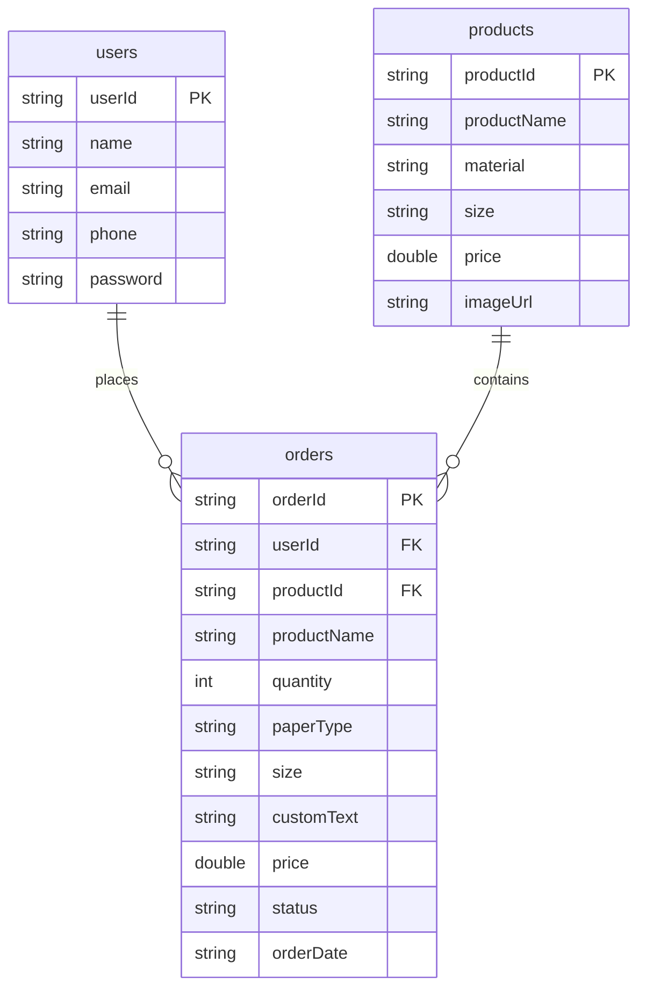

# Technical Documentation - PrintXpress Mobile App

This document explains the technical architecture, directory structure, data models, and database design of the **PrintXpress** native Android application.

---

## 1. Application Architecture

The application is built using a **Multi-Activity** architecture using native Java. It targets HND Software Engineering mobile development patterns, avoiding complex dependency injection, MVVM, or reactive frameworks, relying instead on clean, linear Java and Android SDK methods.

### Base Directory Package: `com.example.printxpress`
To ensure ease of readability and directory copy-pasting, all classes are placed inside the primary package:
- **`LoginActivity.java`**: Launcher screen. Validates inputs, compares credentials against Firestore collection query, and caches sessions.
- **`RegisterActivity.java`**: Form collector. Validates email formats, inputs length, generates a UUID-based ID, and creates user records.
- **`MainActivity.java`**: Product catalog. Mounts RecyclerView, queries collection logs, handles options menus, and manages logout clears.
- **`OrderActivity.java`**: Customization builder. Pulls product info, runs input validation (try-catch conversion check for numbers), and logs order maps.
- **`OrderHistoryActivity.java`**: Real-time tracker. Runs Firestore queries matching active user ID and displays list adapter records.
- **`Product.java`**: Stock item object.
- **`Order.java`**: Customized printing order object.
- **`ProductAdapter.java`**: Bindings card adapter mapping catalog views.
- **`OrderAdapter.java`**: Bindings card adapter mapping customer history, dynamically applying status color states.

---

## 2. Database Design (Cloud Firestore Schema)

The database is built on **Google Firebase Firestore** (NoSQL Document Store). There are three distinct collections:



### Collection Schemas

#### A. Collection: `users`
- **Purpose**: Stores customer profiles and verification credentials.
- **Structure**:
  - `userId` (String): Generated unique ID using `UUID.randomUUID().toString()`.
  - `name` (String): Full name of the customer.
  - `email` (String): E-mail address (used as unique identifier for log in).
  - `phone` (String): Contact phone number.
  - `password` (String): Plain text password for manual comparison.

#### B. Collection: `products`
- **Purpose**: Holds digital printing catalog products.
- **Structure**:
  - `productId` (String): Unique identifier (e.g. `p1`, `p2`).
  - `productName` (String): Product display name (e.g. `Visiting Cards`).
  - `material` (String): Default print paper material weight.
  - `size` (String): Default dimensions.
  - `price` (Double): Base unit price per copy.
  - `imageUrl` (String): Thumbnail image URL (can be empty string for default icon mapping).

#### C. Collection: `orders`
- **Purpose**: Tracks print orders placed by customers.
- **Structure**:
  - `orderId` (String): Unique ID using `UUID.randomUUID().toString()`.
  - `userId` (String): Reference to user document ID who placed the order.
  - `productId` (String): Reference to the product document ID.
  - `productName` (String): Product display name cached for quick views.
  - `quantity` (Int): Count of requested print copies.
  - `paperType` (String): Chosen paper stock.
  - `size` (String): Chosen document layout size.
  - `customText` (String): Instructions or print text.
  - `price` (Double): Total calculated order price (`Base Price * Quantity`).
  - `status` (String): Status code (default: `"Pending"`, can transition to `"Printing"`, `"Ready"`, or `"Cancelled"`).
  - `orderDate` (String): Date-time string formatted as `yyyy-MM-dd HH:mm`.

---

## 3. Session Caching (SharedPreferences)

Instead of complex Firebase Auth token tracking, we use local **`SharedPreferences`** to maintain customer sessions.
- **Preferences file name**: `PrintXpressPrefs`
- **Cached values**:
  - `userId`: Checked at app launch in `LoginActivity` to auto-forward users to `MainActivity` if present. Checked in `MainActivity` to verify credentials.
  - `name`: Stored on login and loaded in `MainActivity` to show a greeting (e.g. `"Welcome Back, Janith Perera!"`).
- **Logout flow**:
  - Calling `editor.clear()` deletes all cached keys, and navigating to `LoginActivity` resets the context.

---

## 4. Key Implementation Highlights

### Beginner-Friendly Try-Catch Validation
In `OrderActivity.java`, the quantity is validated safely inside a standard try-catch block to handle inputs gracefully:
```java
try {
    quantity = Integer.parseInt(quantityStr);
} catch (NumberFormatException e) {
    Log.e(TAG, "Failed parsing quantity input: " + quantityStr, e);
    etQuantity.setError("Quantity must be a valid number");
    return;
}
```

### Real-Time Update Binding
In `OrderHistoryActivity.java`, instead of static loads, the app implements a snapshot listener query filtered by the logged-in user:
```java
db.collection("orders")
    .whereEqualTo("userId", userId)
    .addSnapshotListener(new EventListener<QuerySnapshot>() {
        @Override
        public void onEvent(@Nullable QuerySnapshot value, @Nullable FirebaseFirestoreException error) {
            // handle error and refresh list...
        }
    });
```
This updates the status badges instantly if order states change in the database.
